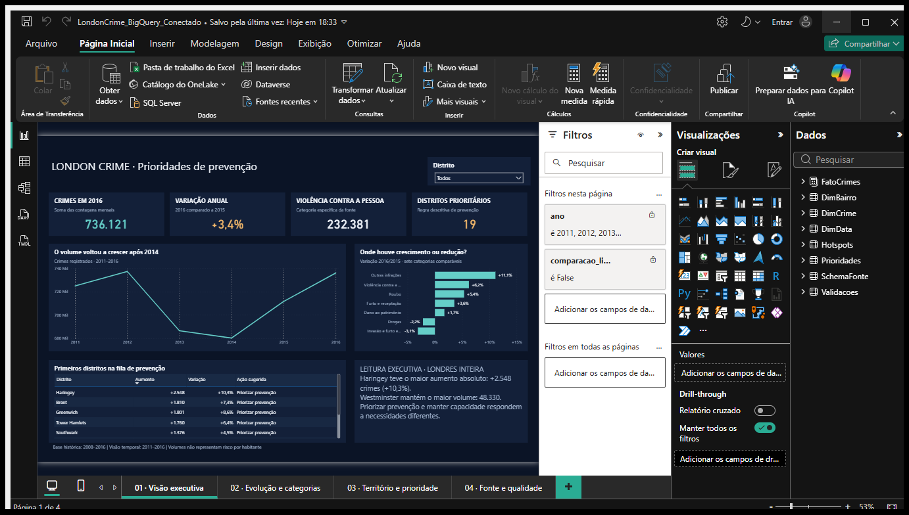

# London Crime Analytics

**Da consulta no BigQuery à decisão no Power BI.** Projeto de análise de crimes registrados em Londres, com extração em Python, validação de dados e dashboard executivo.

   

**Autor:** Eduardo Silva · **Contexto:** atividade prática de análise de dados — EBAC

[Dashboard .pbix](LondonCrime.pbix) · [Script Python](conexao_bigquery_london_crime.py) · [Consultas SQL](resultados/sql/) · [Documentação técnica](RELATORIO_TECNICO.md)

## A pergunta de negócio

Quais tipos de crime estão crescendo ou diminuindo em Londres, em quais bairros e onde devem ser priorizadas ações de prevenção e alocação de recursos policiais?

O projeto combina evolução temporal, categorias de crime, bairros e áreas LSOA. O recorte principal é **2011–2016**, com **2016 como ano de referência**, dentro de uma base histórica de 2008–2016.

## Dashboard



O relatório tem quatro páginas: **Visão executiva**, **Evolução e categorias**, **Território e prioridade** e **Fonte e qualidade**. Indicadores, séries temporais, rankings e filtros por bairro ajudam a acompanhar as mudanças e entender a regra de priorização.

**Para explorar:** baixe [LondonCrime.pbix](LondonCrime.pbix) e abra no Power BI Desktop. Os dados importados permitem consultar o relatório. A atualização pelo BigQuery exige autenticação e acesso ao projeto configurado.

## O que os dados mostram

| Indicador | Resultado | Referência |
|---|---:|---|
| Crimes registrados | **736.121** | Londres, 2016 |
| Variação anual | **+3,4%** | 2016 × 2015 |
| Violência contra a pessoa | **232.381** | 2016 |
| Bairros classificados para priorização | **19** | Regra histórica do projeto |
| Maior aumento absoluto entre bairros | **Haringey: +2.548** | 2016 × 2015, +10,3% |
| Maior volume entre bairros | **Westminster: 48.330** | 2016 |

Violência contra a pessoa cresceu **58,2% entre 2011 e 2016**. No mesmo período, roubos (*Robbery*) diminuíram **38,6%** e crimes relacionados a drogas, **32,4%**. A leitura por categoria mostra que a mudança do total não representa uma evolução uniforme dos tipos de crime.

A priorização considera crescimento da violência em dois anos consecutivos, aumento do total de crimes e volume ou aumento absoluto acima das medianas definidas na análise. A regra completa está documentada no [relatório técnico](RELATORIO_TECNICO.md).

## Dados e validação

**Fonte pública:** `bigquery-public-data.london_crime.crime_by_lsoa` · **Região:** `EU`.

Uma linha da origem é uma contagem mensal por LSOA e subcategoria. **Número de registros e número de crimes são medidas diferentes:** o volume de crimes é calculado com `SUM(value)`.

| Etapa | Evidência |
|---|---|
| Exploração da origem | 13.490.604 registros; 6.447.758 crimes no período completo |
| Estruturação no BigQuery | Tabela de origem com data mensal e tabela consolidada |
| Base do modelo | 31.860 linhas no grão mês × bairro × categoria |
| Qualidade via Python | 16 validações aprovadas na execução registrada |
| Modelo Power BI | 8 tabelas, 6 relacionamentos e 22 medidas |
| Conferência nativa | Totais, crescimento anual, filtros, chaves, duplicidades e valores negativos conferidos por DAX |

As consultas verificam schema, campos obrigatórios, períodos, valores negativos, duplicidades e reconciliação dos totais. Os CSV e as trilhas de auditoria estão em [resultados/](resultados/). A [validação nativa do conector](validacao_conector_bigquery_nativo.json) registra os números conferidos no Power BI Desktop.

## Como reproduzir

Requer Python 3.10 ou superior, Google Cloud CLI para autenticação local e um projeto Google Cloud com BigQuery habilitado. A conta deve poder executar consultas e criar o dataset e as tabelas de destino na região `EU`.

```bash
python -m venv .venv
# Windows: .venv\Scripts\activate
# macOS/Linux: source .venv/bin/activate
python -m pip install -r requirements.txt
gcloud auth application-default login
python conexao_bigquery_london_crime.py --projeto SEU_PROJECT_ID --dataset london_crime_analytics --ano-inicio 2011 --saida resultados_london
```

Substitua `SEU_PROJECT_ID` pelo ID do seu projeto. O script inspeciona a fonte, executa consultas com estimativa e teto de bytes, estrutura as tabelas, valida os resultados e exporta os CSV e o registro da execução. A autenticação usa credenciais do ambiente.

Para consultar as métricas, veja [medidas_london_crime.dax](medidas_london_crime.dax). A versão do projeto para inspeção e edição está em [PowerBI/LondonCrime.pbip](PowerBI/LondonCrime.pbip). Para regenerar o projeto a partir dos resultados, veja as instruções de preparação no [relatório técnico](RELATORIO_TECNICO.md).

## Arquivos do projeto

| Caminho | Conteúdo |
|---|---|
| `LondonCrime.pbix` | Relatório final salvo no Power BI Desktop |
| `PowerBI/` | Projeto PBIP, modelo semântico e definição das quatro páginas |
| `conexao_bigquery_london_crime.py` | Conexão, SQL, tratamento, validação e exportação |
| `resultados/sql/` | 12 consultas nomeadas e auditáveis |
| `resultados/*.csv` | 13 bases e resultados exportados |
| `resultados/execucao_bigquery_london.json` | Execução, schemas, jobs, hashes das SQL e validações |
| `medidas_london_crime.dax` | Medidas analíticas documentadas |
| `print_bigquery_london_crime.png` | Evidência da tabela salva no BigQuery |
| `print_bigquery_schema_london_crime.png` | Evidência do schema |
| `RELATORIO_TECNICO.md` | Documentação detalhada da atividade e da entrega original |

## Limites da interpretação

Esta é uma análise **histórica e descritiva**. Os dados terminam em 2016 e não representam a segurança pública atual. O projeto usa contagens, sem ajuste por população, e não estabelece causalidade.

Zeros em fraude/falsificação e crimes sexuais após 2008 indicam limitações de cobertura; essas categorias foram excluídas das comparações temporais. A cobertura de *City of London* também exige cuidado. A classificação de prioridade é um critério analítico explícito para o exercício e precisa de dados atuais e contexto local para orientar decisões reais.

